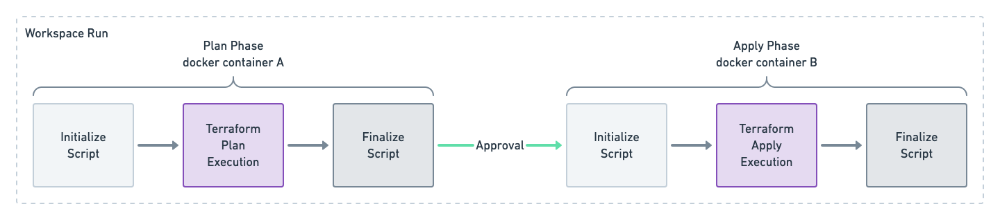

# Terraform Enterprise Alternative Worker

By default TFE ships with a vanilla container that works well for most uses, but there are some cases where it is necessary to customize this image.

This repository outlines how the Alternative Worker image is used during a Workspace Run and contains several examples.

## Workspace Run Flow

When Terraform Enterprise executes a Workspace Run, an ephemeral docker container is created for each phase "plan" and "apply, these containers are short lived and are isolated. 



There are two "Phases" to a run:

* Plan Phase
  * When `terraform plan` is executed
* Apply Phase
  * When `terraform apply` is executed
  * Will be skipped if a speculative plan was queued, there was a failure, a policy check failed, Workspace Run was cancelled or discarded.

Each Phase has three distinct steps; Initialize Script, Terraform Execution, and Finalize Script.

> Note: the Initialize and Finalize Script will run TWICE on a successful Workspace Run that includes an apply.

* Regardless of which Phase you are in, the steps will have the `/terraform` folder with the code for the Workspace Run.
* Any manipulation of the `/terraform` folder in the Plan Phase will persist into the Apply Phase.
* During the Terraform Execution Step, Environment Variables are loaded based on any file that is in the `/env/` directory.
* The `/env/` directory does **not** persist between the Plan and Apply phases.

### Initialize Script

Details:

- Working Directory: `/`
- Run as user: `root`

<details><summary>Environment Variables</summary>
<p>

- HOSTNAME=00aabbccddee
- PWD=/
- HOME=/root
- SHLVL=1
- PATH=/usr/local/sbin:/usr/local/bin:/usr/sbin:/usr/bin:/sbin:/bin
</p>
</details>

This script gives you the ability to perform run time operations just *before* the Terraform Execution.

This file **must** be an executable shell script at `/usr/local/bin/init_custom_worker.sh`.

The `/terraform` directory is pre-populated with the Terraform Code that will be executed as part of this Workspace Run.

Information about the Workspace associated with the Run can be found by inspecting the `/env/` folder:

```sh
hostname=$(cat /env/TF_VAR_ATLAS_ADDRESS)
workspace_name=$(cat /env/TF_VAR_TFC_WORKSPACE_NAME)
run_id=$(cat /env/TF_VAR_TFC_RUN_ID)
```

<details><summary>Full List of Environment Variables</summary>
<p>

- ATLAS_ADDRESS
- ATLAS_CONFIGURATION_NAME
- ATLAS_CONFIGURATION_SLUG
- ATLAS_CONFIGURATION_VERSION
- ATLAS_CONFIGURATION_VERSION_GITHUB_BRANCH
- ATLAS_CONFIGURATION_VERSION_GITHUB_COMMIT_SHA
- ATLAS_CONFIGURATION_VERSION_GITHUB_TAG
- ATLAS_RUN_ID
- ATLAS_TOKEN
- ATLAS_WORKSPACE_NAME
- ATLAS_WORKSPACE_SLUG
- CHECKPOINT_DISABLE
- TERRAFORM_CONFIG
- TFC_CONFIGURATION_VERSION_GIT_BRANCH
- TFC_CONFIGURATION_VERSION_GIT_COMMIT_SHA
- TFC_CONFIGURATION_VERSION_GIT_TAG
- TFC_RUN_ID
- TFC_WORKSPACE_NAME
- TFC_WORKSPACE_SLUG
- TFE_RUN_ID
- TF_APPEND_USER_AGENT
- TF_ATLAS_DIR
- TF_FORCE_LOCAL_BACKEND
- TF_INPUT
- TF_IN_AUTOMATION
- TF_REGISTRY_DISCOVERY_RETRY
- TF_VAR_ATLAS_ADDRESS
- TF_VAR_ATLAS_CONFIGURATION_NAME
- TF_VAR_ATLAS_CONFIGURATION_SLUG
- TF_VAR_ATLAS_CONFIGURATION_VERSION
- TF_VAR_ATLAS_CONFIGURATION_VERSION_GITHUB_BRANCH
- TF_VAR_ATLAS_CONFIGURATION_VERSION_GITHUB_COMMIT_SHA
- TF_VAR_ATLAS_CONFIGURATION_VERSION_GITHUB_TAG
- TF_VAR_ATLAS_RUN_ID
- TF_VAR_ATLAS_WORKSPACE_NAME
- TF_VAR_ATLAS_WORKSPACE_SLUG
- TF_VAR_TFC_CONFIGURATION_VERSION_GIT_BRANCH
- TF_VAR_TFC_CONFIGURATION_VERSION_GIT_COMMIT_SHA
- TF_VAR_TFC_CONFIGURATION_VERSION_GIT_TAG
- TF_VAR_TFC_RUN_ID
- TF_VAR_TFC_WORKSPACE_NAME
- TF_VAR_TFC_WORKSPACE_SLUG
- TF_VAR_TFE_RUN_ID
- TF_VAR_TF_ATLAS_DIR
- TF_X_SHADOW
</p>
</details>

Alternatively, some information about the Run can be found by parsing the TFE generated file in the `/terraform/zzz_backend_override.tf.json` directory.

```sh
hostname=$(cat /terraform/zzz_backend_override.tf.json | jq -r '.terraform[0].backend[0].remote.hostname')
organization_name=$(cat /terraform/zzz_backend_override.tf.json | jq -r '.terraform[0].backend[0].remote.organization')
workspace_name=$(cat /terraform/zzz_backend_override.tf.json | jq -r '.terraform[0].backend[0].remote.workspaces.name')
```

```json
{
  "terraform": [
    {
      "backend": [
        {
          "remote": {
            "hostname": "firefly.tfe.rocks",
            "organization": "someotherorg",
            "workspaces": {
              "name": "debug"
            }
          }
        }
      ]
    }
  ]
}
```

If you wish to stop the Run, exit with a non-zero status and the run will fail.

### Terraform Execution

Details:

- Working Directory: `/terraform`
- Run as user: `root`

<details><summary>Environment Variables</summary>
<p>

- ATLAS_RUN_ID=run-00aabbccddee
- TF_VAR_ATLAS_CONFIGURATION_SLUG=orgName/wsName
- TFC_WORKSPACE_NAME=wsName
- HOSTNAME=00aabbccddee
- TF_INPUT=0
- ATLAS_WORKSPACE_NAME=wsName
- HOME=/root
- OLDPWD=/
- TF_X_SHADOW=0
- TF_TEMP_LOG_PATH=/tmp/terraform-log00aabbccddee
- TF_REGISTRY_DISCOVERY_RETRY=2
- TF_VAR_ATLAS_CONFIGURATION_NAME=wsName
- TF_VAR_ATLAS_WORKSPACE_SLUG=orgName/wsName
- ATLAS_CONFIGURATION_SLUG=orgName/wsName
- TF_VAR_TFC_WORKSPACE_SLUG=orgName/wsName
- PATH=/usr/local/sbin:/usr/local/bin:/usr/sbin:/usr/bin:/sbin:/bin
- ATLAS_TOKEN=00aabbccddee.atlasv1.00aabbccddee
- TF_VAR_ATLAS_ADDRESS=https://tfe.company.com
- TF_APPEND_USER_AGENT=TFE/v202104-1
- TF_VAR_ATLAS_RUN_ID=run-00aabbccddee
- TF_PANICWRAP_STDERR=false:78
- TFC_WORKSPACE_SLUG=orgName/wsName
- TF_VAR_TFC_RUN_ID=run-00aabbccddee
- TF_VAR_ATLAS_WORKSPACE_NAME=wsName
- ATLAS_CONFIGURATION_NAME=wsName
- TF_VAR_TFE_RUN_ID=run-00aabbccddee
- ATLAS_WORKSPACE_SLUG=orgName/wsName
- CHECKPOINT_DISABLE=1
- TERRAFORM_CONFIG=/tmp/cli.tfrc
- TF_VAR_TFC_WORKSPACE_NAME=wsName
- PWD=/terraform
- TF_IN_AUTOMATION=1
- TFC_RUN_ID=run-00aabbccddee
- ATLAS_ADDRESS=https://tfe.company.com
- TFE_RUN_ID=run-00aabbccddee
- TF_FORCE_LOCAL_BACKEND=1
</p>
</details>

Contains the Terraform Code.

`/terraform/terraform.tfvars` file from the WS variables.
`zzz_ba` file with workspace backend information.

### Finalize Script

Details:

- Working Directory: `/`
- Run as user: `root`

<details><summary>Environment Variables</summary>
<p>

- HOSTNAME=00aabbccddee
- PWD=/
- HOME=/root
- SHLVL=1
- PATH=/usr/local/sbin:/usr/local/bin:/usr/sbin:/usr/bin:/sbin:/bin
</p>
</details>

This script gives you the ability to perform run time operations just *after* the Terraform Execution.

This file **must** be an executable shell script at `/usr/local/bin/finalize_custom_worker.sh`.


## Developing

For simplicity sake we will assume these commands are run directly on the TFE instance during development.

**Build the image**

Give the image a name for easy reference later, this name can be whatever you wish.

```sh
docker build -t tfe-alt-worker .
```

**Debug the Image**

Run the image and poke around to ensure things are running as you would expect.

```sh
docker run --rm -it tfe-alt-worker /bin/bash
```

## Tips

If you want to see what the default TFE worker looks like, you can run it from the TFE instance itself and poke around.

```sh
# Run an ephemeral container and bash into it
docker run --rm -it hashicorp/build-worker:now /bin/bash
```

---

Adding a `sleep 60` to the Initialize Script gives you an opportunity to start a Workspace Run and then `docker exec` into the running container to debug/develop that script.

---

The file `ca-certificates.crt` can be left empty if no private/additional Certificate Authorities are needed.

> Note: It is critical that we call update-ca-certificates in the Dockerfile to populate common trusted certificates.

---

If a Docker Registry is not easily available, it is possible to save this image as an archive.

Build that image and export as a tar, this can be saved like any other binary (i.e. S3, file share, etc...):
```sh
docker save tfe-alt-worker > tfe-alt-worker.tar
```

From the TFE instance, copy that tar and load it:
```sh
docker load --input tfe-alt-worker.tar
```

## Resources

[TFE Alternative Worker](https://www.terraform.io/docs/enterprise/install/installer.html#alternative-terraform-worker-image)
[Initialize Script](https://www.terraform.io/docs/enterprise/install/installer.html#initialize-script)
[Finalize Script](https://www.terraform.io/docs/enterprise/install/installer.html#finalize-script)
